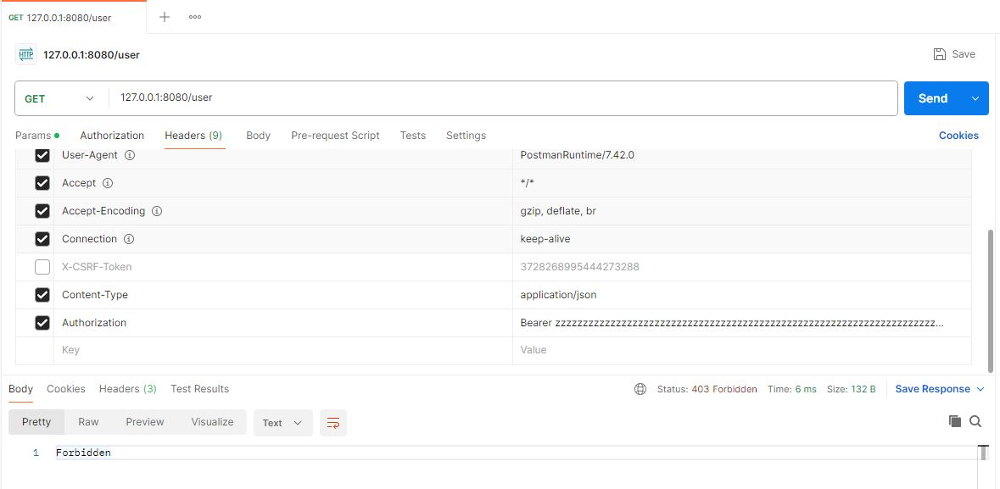

# RustAPIJWTTutorial
Rust API tutorial with the use of JWT tokens

## Configuring your DB
To configure your database, first go to: https://www.sqlite.org/download.html

Then, unzip the zip file somewhere on your PC. Add the path where the content was unzipped to your environment variables in Windows.

Once this is done, open a console. Verify that you have it installed (and that it is working OK with the console):
```bash
sqlite3 --version
```

Then create a new database:
```bash
sqlite3 users.db
```

This will show the sqlite prompt. In there, execute the command:
```sql
CREATE TABLE IF NOT EXISTS users (id INTEGER PRIMARY KEY, username TEXT, password TEXT, roles TEXT);
```

To exit the prompt, type '.' (the period character alone)

## Debugging Rust
To debug Rust, I added the extension CodeLLDB.

Then, I went to the 'Run and Debug' section of VSCode. I selected the link to create a launch.json file. Then, a list of types of launch.json files are suggested. Choose LLDB. VSCode will realize you have a Rust project, and suggest you to configure it for you. Accept to have VSCode configure the debug configuration for you. That's it!

However, note that you can't just relaunch the server using the relaunch icon (green arrow going back on itself). You need to shut down (red square) your server, and restart manually every time you make a change

## Modules
You can have a folder name for a module (with its own mod.rs file, which represents the code for that module). Any files in the same folder with a different name will be considered as submodules.

Otherwise, you can have files at the same level as main.rs that you can import using only 'mod'

## Documentation
Here are some details as to how the application works.

Once you have completed the 'Configuring your DB' section, then you can start following the documentation below.

Run your application with 'cargo run' from the project directory. Then, open Postman to prepare yourself to send API requests.

### Register API
The first API that you are going to want to use is the register API (POST request). The server launches on port 8080 of the localhost. Go to Postman, and fill in the details as in the screenshot. Note that you can change the values of 'username' and 'password'. The 'role' field only accepts "Admin" or "User" (but anything that isn't 'User' still identifies as 'User').

Important: make sure you have the header 'Content-Type' associated with 'application/json' for your request. Also, to put JSON in the body of your request, go to Body and select 'raw'. There, open your curly brackets and start writing your JSON object.


If you have not forgotten any values (i.e. username, password, role) and your DB is correctly configured, you should get a message that your user was added.

### Login API
Once your user is added, it's time to login! In your JSON, keep the 'username' and 'password' values. Remove the 'role' value as it is no longer useful.

Send the request with the POST method.


The return of the login should be the JWT token.

### Admin API
To transition to the Admin and User endpoints, you are going to have to use the JWT token you received from the Login endpoint. Go to your Headers in Postman, and add the header 'Authorization' with value 'Bearer TOKEN', where TOKEN represents the value received from the Login endpoint response, and 'Bearer ' is a prefix. There is no JSON associated with this request.

This is a GET method request.

If you have created a user with role 'user', then you should get a forbidden message.


If you have created a user with role 'admin', then you should not get a forbidden message.


### User API
If you have created a user with role 'user', this is where you validate everything is going ok. There is no JSON associated with this request.

Important: Check out the Admin API section to set up your JWT token.

This is a GET method request.


If we were to scramble the JWT token, we see that it would give us a forbidden message.



### Other API information
In case you wanted some visuals for the headers, here is a screenshot of the headers I added.


## Other
### Get Optimized Executable
```
cargo build --release
``` 

### To Easily Update All Dependencies
```
cargo update
```